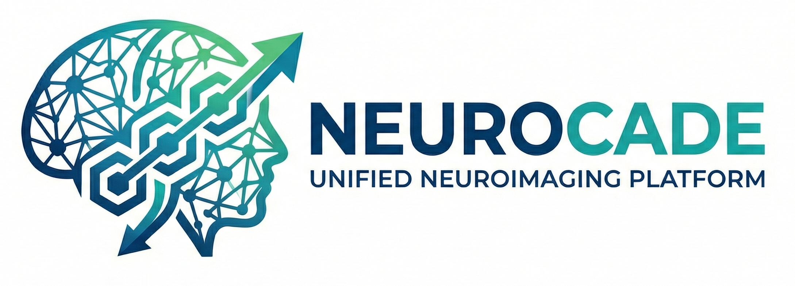

# NeuroCade

NeuroCade is a neuroimaging workspace for managing MRI cases, running containerized processing tools, and coordinating AI-assisted analysis workflows.
It can be used as a local app or installed on a server and acccessed via a web-browser.


## Quick Start

Install NeuroCade locally:

```bash
bash <(curl -fsSL https://raw.githubusercontent.com/Deep-MI/NeuroCade/main/scripts/install.sh) --mode local --desktop
```

The one-line installer clones the latest stable release by default. Add
`--prerelease` for the latest beta release or `--dev` for the repository default
branch.

If `curl` is unavailable:

```bash
bash <(wget -qO- https://raw.githubusercontent.com/Deep-MI/NeuroCade/main/scripts/install.sh) --mode local --desktop
```

From an existing checkout:

```bash
./scripts/install.sh --mode local --desktop
./scripts/desktop/run.sh
```

For server install choose --mode internal. This is intended for local networks
More detailed install instructions are located at [INSTALL.md](INSTALL.md)
