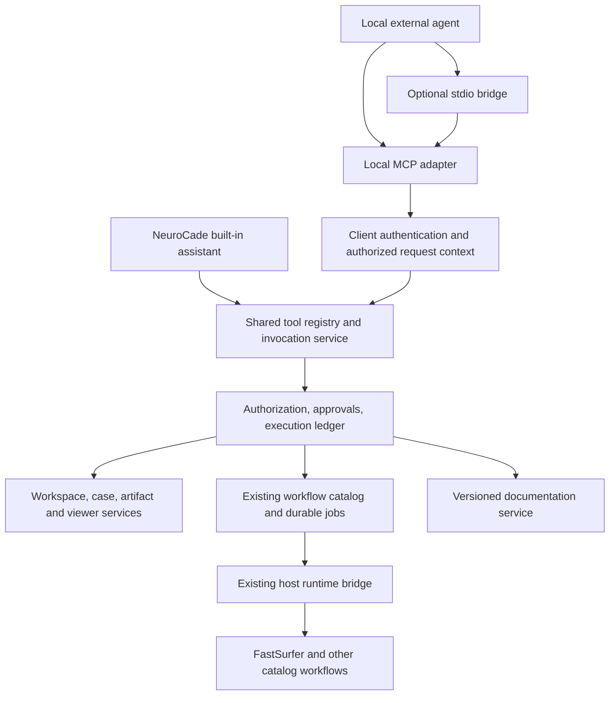

# NeuroCade joint MCP adapter

Design proposal · 9 September 2026 · Status: ready for implementation review

## 1. Decision and scope

Add an optional MCP adapter to NeuroCade so locally running AI agents can use NeuroCade’s existing workspace, case, artifact, viewer, and workflow capabilities, including FastSurfer. Publish one logical MCP service named `neurocade`. Include versioned NeuroCade and FastSurfer documentation through that service.

The adapter is another interface to NeuroCade’s application capabilities. It does not run another language model, create a second workflow engine, or launch FastSurfer directly. NeuroCade’s built-in assistant and external agents use the same tool definitions, authorization, approval rules, execution ledger, and workflow runtime.

First-release goals:

- Explicit opt-in when launching NeuroCade; existing launches remain unchanged.
- Local agent connection with generated setup instructions and a connection test.
- Documentation retrieval, authorized case inspection, catalog discovery, workflow submission, progress, cancellation, and result inspection.
- Jobs and external activity visible in NeuroCade alongside work started through its UI or built-in assistant.
- Operation without an AI provider key configured in NeuroCade: the external agent supplies the reasoning.

Out of scope: hosted gateways, public connectors, remote OAuth onboarding, direct cloud-chat access to localhost, standalone FastSurfer deployment, arbitrary host shell access, and automatic delegation to NeuroCade’s built-in assistant. A local agent may itself send tool results to a cloud model; local execution does not imply fully local inference.

## 2. Existing architecture and implications

This proposal is based on public NeuroCade commit `3f28b26bfd8a4a98663d9a0f9cbb906db147bfcf`. Source inspection was read-only; no implementation or runtime verification was performed. Names and flags identified as proposed below do not exist merely because they appear in this document.

| Observed component | Existing behavior | Design consequence |
|---|---|---|
| `assistant/tools/definition.py` | Provider-independent `ToolDefinition`, `ToolResult`, and `ToolExecutionContext`; risk categories `read`, `gui`, `write`, `workflow` | Add an MCP serializer; retain the underlying contracts |
| `assistant/tools/builder.py` | Scope-aware registry; workspace tools differ from case and GUI tools; GUI overrides have server-pinned identity fields | Build definitions for an authorized request context, not a global active case |
| `assistant/tool_executor.py` | Tool execution includes approval, replay, error handling, and result recording inside an assistant-state loop | Extract shared single-invocation execution, keeping conversation logic in the assistant |
| `assistant/tool_execution_store.py` | Ledger planning requires an existing assistant turn; workflow run IDs derive from turn/call identity | MCP needs durable invocation identity without fabricating chat turns |
| `assistant/tools/catalog_tools.py` | `tool_search`, `tool_inspect`, `tool_call`, run status/list/cancel, and configuration tools | Reuse this catalog rather than add a competing `run_fastsurfer` implementation |
| `assistant/tools/catalog_execution.py` | Model-controlled submission accepts only workflow ID and ordered inputs; validated runs are durably queued | Preserve fixed catalog execution; do not silently add arbitrary flags or commands |
| `main.py` | Explicit single-process application with in-process jobs, SQLite persistence, recovery, and matched runtime bridge | Adapter must share this application process; no second job manager or additional backend workers |
| `backend_common/auth.py` | Local mode can resolve a local owner when a request lacks a valid external credential | MCP requires its own mandatory credential gate before normal user/workspace resolution |
| `scripts/run.sh` | Manages app/bridge lifecycle, launch identity, runtime selection, and actual app URL; occupied app ports can move | MCP connection discovery must use the actual launched endpoint |

These observations establish reusable building blocks, not proof that every handler is already suitable for external exposure. Release requires a tool-by-tool policy and result-shape audit.

## 3. Architecture



Mount a dedicated MCP ASGI application at `/mcp` within the existing backend process when enabled. Use the maintained Python MCP SDK for protocol handling. Pin the tested SDK version and negotiate supported protocol versions; do not handwrite JSON-RPC framing or claim compatibility with untested versions.

For the first release, enable MCP only in NeuroCade’s local deployment profile, with the host-facing application listener restricted to loopback. If the deployment binds externally, reject `--mcp` with an actionable error. This avoids accidentally exposing MCP on an internal/demo web deployment. A future distinct loopback listener can relax that restriction without changing tool contracts.

Docker may listen on all interfaces inside its container, but the published host port must bind to `127.0.0.1`. Verify this at the launcher/runtime configuration boundary. Do not confuse the host runtime bridge with the MCP endpoint, and never disclose or reuse its token for agents.

Use Streamable HTTP as the canonical transport. Provide a small, client-launched stdio bridge for clients that expect a command. The bridge forwards to the already-running adapter; it imports no backend job state and never starts another NeuroCade instance. It logs only to stderr and emits only MCP messages on stdout. Both transports expose the same service and permissions. [P1]

## 4. Launch and connection experience

Proposed launch interface:

```sh
./scripts/run.sh start --mcp
./scripts/run.sh start --mcp --mcp-access read
./scripts/run.sh start --mcp --mcp-access standard
```

`--mcp` defaults to `standard`: authorized reads are available and operations classified as writes/workflows retain NeuroCade’s confirmation requirement. `read` excludes mutating tools. No blanket auto-approval mode is proposed for v1. A future desktop launcher should present the equivalent “Allow local AI agents” setting.

Define `NEUROCADE_MCP_ENABLED=false` and `NEUROCADE_MCP_ACCESS=standard` as proposed configuration fields. Explicit flags override configuration. Invalid combinations fail validation before launch. An already-running instance reports its current setting; asking for a different setting returns a restart instruction rather than restarting active work implicitly.

Startup sequence:

1. Validate profile, host bind, adapter settings, and selected runtime.
2. Run existing database initialization and job/runtime recovery once.
3. Start the MCP lifespan in the same application process.
4. Publish a connection descriptor only after initialization succeeds. Include the actual endpoint, launch ID, adapter version, and authentication method; exclude credentials.
5. Show “Local agent access: enabled” and the connection setup page in NeuroCade. `status` and `doctor` report endpoint health separately from app and runtime health.

The user selects “Connect an agent” in NeuroCade, names the client, selects a workspace and access profile, and receives a generated HTTP configuration or stdio command. Credentials are per client, revocable, and stored in a private local credential file. Generated configuration references that file via the bridge rather than embedding a token in a URL or command argument. The exact native HTTP credential format depends on the client; offer the stdio bridge when secure credential configuration is unavailable.

Proposed bridge command:

```sh
neurocade-mcp connect --connection-file /absolute/path/to/private-client-config.json
```

This is a new packaged entry point, not an existing command. Client configuration should use an absolute executable path supplied by the installer. Installation includes the bridge in NeuroCade’s managed runtime, avoiding a separate Python setup for the user.

When disabled, `/mcp` is absent and no descriptor advertises an enabled service. When explicitly requested startup fails, report failure clearly and invalidate any descriptor; do not silently fall back to an apparently successful MCP launch. Disabling/revoking MCP ends agent access but does not cancel submitted analysis jobs. Full application shutdown follows existing runtime lifecycle semantics; the adapter must not promise that arbitrary running jobs survive process termination.

## 5. Reuse the agentic integration

Introduce a transport-neutral `ToolInvocationService` (proposed name) beneath `AssistantToolExecutor`. It receives a resolved principal, authorized workspace/case scope, tool definition, arguments, invocation identity, and event sink. It performs validation, policy checks, approval resolution, durable execution, and result recording.

Keep model prompting, conversation assembly, repeated-call heuristics, turn streaming, and model-specific response formatting inside the existing assistant. External tool calls must not enter the model loop. In particular, repeated status polling from MCP is legitimate and must not trigger the assistant’s identical-consecutive-call stopping heuristic.

The shared registry should produce definitions independently of OpenAI serialization. Keep `as_openai_tool()` for existing consumers and add a separate MCP mapping. Preserve stable internal names; the public MCP names can use a `neurocade_` prefix through an explicit mapping table. Workflow-ledger behavior must depend on declared operation metadata, not a fragile string comparison against `tool_call`.

Add documentation definitions to this shared registry so the built-in assistant benefits from the same lookup tools. Give both consumers short instructions to inspect the selected workflow and resolve matching documentation before proposing execution settings. Instructions assist behavior; executable schemas and application validation remain authoritative.

## 6. Context and public tools

Bind each client credential to a user, one authorized workspace, and granted capability scopes. For v1, users can create multiple connections for different workspaces. Do not expose an unrestricted workspace-switch action. Each case operation supplies an explicit case ID, checked against the bound workspace. Workspace operations declare that scope explicitly. Do not infer a case from the latest browser tab or another agent’s last request.

The adapter reconstructs trusted handler state per request, including a fresh database session. Client input cannot set `user_id`, role, root paths, approval state, turn identity, or GUI identity. Do not cache state-bound handler closures across requests or clients.

Proposed public surface; existing handlers are reused where available, while the wrapper contracts and documentation tools are new:

| Tool group | Proposed MCP tools | Notes |
|---|---|---|
| Discovery | `neurocade_get_context` | Instance/version, bound scope, access, available runtime and documentation versions |
| Cases | `neurocade_list_cases`, `neurocade_get_case` | Authorized summaries; bounded pagination |
| Files and artifacts | `neurocade_list_artifacts`, `neurocade_read_artifact` | Existing artifact IDs or validated virtual paths; explicit size/type limits |
| Catalog | `neurocade_tool_search`, `neurocade_tool_inspect` | Reuse catalog search/inspect; return workflow ID and version/configuration identity |
| Execution | `neurocade_tool_call` | Explicit scope, catalog ID, ordered inputs, durable idempotency key |
| Runs | `neurocade_tool_run_status`, `neurocade_tool_run_list`, `neurocade_tool_run_cancel` | Existing run store and cancellation semantics |
| Documentation | `neurocade_docs_search`, `neurocade_docs_read` | Product, version, query/page ID; no arbitrary URL fetching |
| Invocations | `neurocade_get_invocation` | Approval/execution status and durable run reference; never grants approval |

Only expose audited tools. Workflow configuration editing, deletion, broad file writes, and viewer manipulation are excluded from the initial core profile. Add them later through explicit capabilities while reusing their existing handlers and approvals.

Viewer integration requires explicit attachment to a user-selected viewer session. Default external requests have no viewer attachment. A later `viewer` capability can expose existing GUI tools, with authorized session keys and revision checks; two agents must not silently manipulate the same viewer. Return `VIEWER_NOT_ATTACHED` when an operation requires an active viewer. Background workflow execution and documentation must work with no browser open.

## 7. Durable invocation and approval contract

The current execution store is assistant-turn-bound. Refactor it into a shared invocation ledger while retaining compatibility with existing assistant records. Proposed records carry: invocation ID, source (`builtin_assistant` or `mcp`), actor, client ID, workspace/case, internal operation, canonical arguments digest, workflow configuration digest, optional assistant turn/call ID, idempotency key, approval state, execution state, external run ID, timestamps, and a bounded result reference.

Migration should preserve existing records and run references, allow assistant linkage to be optional for MCP invocations, and provide a compatibility facade for assistant history. Exact database migration mechanics require inspecting model constraints during implementation; do not pass a null turn to the current store and assume it remains durable.

For mutations, require a caller-supplied idempotency key. Enforce a database uniqueness constraint on `(client_id, workspace_id, idempotency_key)` and compare operation, scope, arguments, and resolved configuration digests. A matching retry returns the same invocation/run. Changed content returns `IDEMPOTENCY_CONFLICT`. MCP request IDs and connection session IDs are not durable operation identities. Persist the run identity before enqueueing, and reuse existing submission/reconciliation mechanisms. Handle an uncertain crash by reconciling that identity, not blindly rerunning.

Preserve existing `ToolRisk` policy: reads and GUI operations currently differ from writes/workflows, which require confirmation. Translate MCP annotations from audited metadata, but never treat client annotations or a model-supplied `approved=true` as permission.

Approval flow for v1:

1. Validate the call and persist a planned invocation with the existing approval presentation.
2. Return a normal structured result with `status: awaiting_approval`, invocation ID, and an application approval link. No job is submitted yet.
3. The authenticated user reviews the exact operation in NeuroCade’s shared activity/approval UI.
4. On approval, the shared service rechecks authorization and configuration identity, records approval atomically, and executes or enqueues exactly once.
5. The agent retrieves the invocation or retries with the same key to obtain the result/run ID. Denial and expiry remain durable, queryable outcomes.

This requires extending the approval UI beyond chat-turn ownership. Pending approvals expire after a configurable interval, proposed default 15 minutes. Revocation invalidates pending approvals. If inputs or workflow configuration have materially changed, require a fresh review. The agent has no approval-granting tool. Native client confirmation can supplement this flow but is not accepted as a substitute without a future authenticated approval integration.

## 8. Jobs, results, and concurrency

FastSurfer execution always uses the catalog and existing runtime bridge. Continue accepting fixed catalog workflows and ordered `/case` or `/workspace` inputs; MCP does not introduce arbitrary command options. If a documented mode is not exposed in the installed catalog, report that limitation. Catalog capability and runtime inspection, not documentation alone, determine what can run.

For MCP, submit asynchronously even when a catalog workflow has a synchronous assistant presentation mode. Implement this as a shared execution option that skips waiting after enqueueing, without changing the workflow itself. Return the durable run ID; use bounded status reads. Do not require experimental MCP task extensions or a long-lived stream for v1 correctness.

Distinguish adapter invocation status from workflow status. A successfully submitted invocation can refer to a still-running workflow. Reuse the existing `RunStatus` values rather than inventing a second job state machine. A dropped connection or canceled status request never cancels a submitted analysis; cancellation requires the explicit run-cancel operation and its policy checks.

Use a consistent result envelope containing status, invocation ID where relevant, data, artifact references, warnings, and a structured error when present. Map application failures to MCP tool error results; malformed protocol requests use protocol errors. Pending approval is an expected result, not an execution failure. Proposed errors include `FORBIDDEN`, `INVALID_INPUT`, `APPROVAL_REQUIRED` where a client cannot proceed, `IDEMPOTENCY_CONFLICT`, `RUNTIME_UNAVAILABLE`, `DOC_VERSION_UNAVAILABLE`, and `VIEWER_NOT_ATTACHED`.

Provide text summaries plus structured content. Do not embed entire MRI volumes. Artifact reads enforce membership, allowed media types, virtual-path containment and symlink resolution, and size limits. Previews are requested explicitly and returned through existing rendering services when available. Scope every result and download reference; knowing an artifact or run ID never grants access.

Concurrency uses separate database sessions and existing job admission rules. Add atomic revision checks or a per-case execution guard where workflows mutate shared outputs. Reject conflicting launches with an actionable busy/conflict result; allow independent cases within existing resource limits. Retry deduplication applies to a single authorized intent and does not prohibit an explicitly requested repeat analysis with a new key.

## 9. Joint documentation service

Ship an offline-searchable documentation bundle with separate `neurocade` and `fastsurfer` collections, exposed through the same MCP service and built-in registry. FastSurfer’s official documentation entry point is [P3]. Documentation retrieval does not require FastSurfer to be installed.

At build/release time, import allowlisted upstream source at a pinned tag/commit, preserve source links and license notices, normalize pages into heading-sized sections, and build a lightweight full-text index. Retain command examples, option spelling, headings, and warnings. Start with text search; semantic indexing is an optional later improvement.

Each section records product, documentation version, source revision, canonical URL, page ID, heading/anchor, content digest, and indexed text. A bundle manifest identifies supported software versions and bundle checksum. Updates are explicit, verified, and atomic; never fetch arbitrary user-supplied URLs or silently refresh content during an analysis.

`docs_search` accepts product, query, optional version or workflow/run reference, and a bounded result count. It returns excerpts and citations. `docs_read` takes an indexed page/section ID with pagination or bounded section selection. Optional MCP resources may expose these pages, but tool-based lookup remains available for clients with limited resource support. [P2]

Version resolution: use the recorded version/image identity for an existing run, or the selected workflow’s declared image/version for a new analysis. A machine can have multiple FastSurfer images; do not assume one global installed version. Match through explicit release metadata. When the exact documentation is unavailable, return that fact and available versions; a clearly labeled fallback requires an explicit selection. For general questions with no selected runtime, use the bundle’s documented default and disclose it.

The runtime schema defines executable inputs, the workflow configuration defines the installed preset, and documentation explains behavior. Preserve disagreement visibly. Include software/image identity, workflow configuration digest, and consulted documentation revision in analysis provenance when available.

## 10. Authentication, data boundaries, and observability

Use high-entropy opaque local client credentials; store only hashes server-side and protect client credential files with owner-only permissions. Associate them with an existing NeuroCade user and workspace. Every MCP request, including discovery and resources, requires this credential. Recheck membership on each operation. Do not fall through to local-owner authentication when credentials are missing or invalid.

Validate Host and any supplied Origin on `/mcp` even in the local profile; the existing hardened-profile middleware alone is insufficient. Allow only configured loopback hosts/origins, reject invalid Origins, and disable wildcard CORS. Native clients may omit Origin but still require authentication. Enforce request/output bounds and client rate/concurrency limits. [P1]

Display connected clients, granted workspace/access, last activity, pending approvals, and a revoke action in NeuroCade. Record source/client, operation, actor, scope, invocation/run ID, outcome, and duration in the existing monitoring/activity system. Store bounded diagnostics; redact credentials and avoid raw scan contents in logs. UI activity identifies external actions without inserting fabricated messages into an unrelated assistant conversation.

Local connectivity is a reachability boundary, not protection from malicious software running as the same OS user. Connection setup should explain that requested tool results become accessible to the chosen agent and its configured model provider.

## 11. Implementation plan

| Phase | Deliverable | Exit criterion |
|---|---|---|
| 1. Shared execution | Extract invocation service and registry serialization; migrate ledger/approval linkage | Existing assistant approval, replay, workflow and history tests pass without behavioral regression |
| 2. Local adapter | Conditional ASGI mount, strict local credential gate, launch flags, descriptor, status/doctor | Disabled launch exposes no MCP; enabled launch works through the actual Docker and Apptainer local endpoints |
| 3. Core tools and documentation | Audited read surface, catalog execution, shared approval UI, versioned documentation index | A local client can find a case, inspect FastSurfer docs/preset, approve a run in NeuroCade, and retrieve results |
| 4. Client packaging | Managed stdio bridge, generated client configurations, setup and revocation UI | Fresh-user setup works in at least two tested local MCP hosts; exact host/version compatibility is documented |
| 5. Optional extensions | Viewer attachment, additional write capabilities, richer previews | Session isolation and capability-specific acceptance tests pass |

Suggested new modules: `api_service/mcp_adapter/{server,auth,context,serialization}.py`, shared invocation/approval services, and `api_service/documentation/{bundle,search,tools}.py`. These are proposed locations. Extend existing launcher/runtime environment forwarding, settings, dependency packaging, migrations, monitoring UI, and tests. Package the stdio bridge separately from backend imports, with matched release metadata.

## 12. Verification and acceptance criteria

The following are planned implementation checks, not tests already run:

- **Parity:** identical authorized built-in and MCP requests resolve the same workflow, validate the same inputs, produce equivalent results, and obey the same approval rule.
- **Authentication:** missing/invalid credentials never reach local-owner fallback; cross-workspace/case/run/artifact access fails; revocation takes effect on active sessions and pending actions.
- **Launch:** disabled route absent; nonlocal profile/bind rejected; actual fallback port discovered; stale descriptors rejected; correct Docker host publication and Apptainer loopback behavior; single backend worker retained.
- **Protocol:** SDK initialization, supported versions, tool schemas, structured errors, HTTP sessions where used, stdio framing, reconnect, output limits, and client process exit.
- **Replay:** dropped response, duplicate submission, changed arguments under the same key, crash between persistence/enqueue/result recording, and restart reconciliation never cause a blind duplicate run.
- **Approval:** reads execute; writes wait; denial/expiry/configuration change prevents execution; one approval executes once; external agents cannot approve themselves.
- **Jobs:** closing the agent leaves queued/running work under NeuroCade ownership; explicit cancellation works; status polling is not blocked by assistant conversation heuristics.
- **Isolation:** simultaneous agents and the built-in assistant do not exchange case state, database sessions, viewer state, or private results; shared-output conflicts are rejected.
- **Documentation:** offline lookup, exact-version selection, multiple images, unavailable-version response, source citations, bundle integrity, and readable bounded command examples.
- **Usability:** on a fresh local install, connect a client without editing backend settings, ask a documentation question, submit a sample workflow, approve in NeuroCade, and inspect its output. Use mocked jobs for routine tests and one existing FastSurfer sample evaluation for end-to-end validation.

## 13. Decisions for implementation review

The proposed defaults are settled enough to implement: one integrated service, local-only v1, Streamable HTTP plus stdio bridge, shared execution, explicit workspace binding, application-owned approvals, and offline versioned docs.

Before coding, confirm the precise ledger migration against database models, the SDK lifespan integration with the current FastAPI process, the official documentation source/tag mapping for shipped FastSurfer images, and the initial audited artifact-read surface. These are bounded implementation investigations, not reasons to introduce separate MCP services or a new agent runtime.

## Source references

All NeuroCade links below are pinned to the inspected revision.

- [N1: Tool contracts](https://github.com/Deep-MI/NeuroCade/blob/3f28b26bfd8a4a98663d9a0f9cbb906db147bfcf/api-service/api_service/assistant/tools/definition.py)
- [N2: Scope-aware tool builder](https://github.com/Deep-MI/NeuroCade/blob/3f28b26bfd8a4a98663d9a0f9cbb906db147bfcf/api-service/api_service/assistant/tools/builder.py)
- [N3: Assistant executor](https://github.com/Deep-MI/NeuroCade/blob/3f28b26bfd8a4a98663d9a0f9cbb906db147bfcf/api-service/api_service/assistant/tool_executor.py)
- [N4: Execution ledger](https://github.com/Deep-MI/NeuroCade/blob/3f28b26bfd8a4a98663d9a0f9cbb906db147bfcf/api-service/api_service/assistant/tool_execution_store.py)
- [N5: Catalog tools](https://github.com/Deep-MI/NeuroCade/blob/3f28b26bfd8a4a98663d9a0f9cbb906db147bfcf/api-service/api_service/assistant/tools/catalog_tools.py)
- [N6: Catalog execution](https://github.com/Deep-MI/NeuroCade/blob/3f28b26bfd8a4a98663d9a0f9cbb906db147bfcf/api-service/api_service/assistant/tools/catalog_execution.py)
- [N7: Application lifecycle](https://github.com/Deep-MI/NeuroCade/blob/3f28b26bfd8a4a98663d9a0f9cbb906db147bfcf/api-service/api_service/main.py)
- [N8: Launcher](https://github.com/Deep-MI/NeuroCade/blob/3f28b26bfd8a4a98663d9a0f9cbb906db147bfcf/scripts/run.sh)
- [N9: Authentication](https://github.com/Deep-MI/NeuroCade/blob/3f28b26bfd8a4a98663d9a0f9cbb906db147bfcf/backend_common/auth.py)
- [N10: HTTP middleware](https://github.com/Deep-MI/NeuroCade/blob/3f28b26bfd8a4a98663d9a0f9cbb906db147bfcf/api-service/api_service/middleware.py)
- [P1: MCP transport specification](https://modelcontextprotocol.io/specification/2025-11-25/basic/transports)
- [P2: MCP tools specification](https://modelcontextprotocol.io/specification/2025-11-25/server/tools)
- [P3: FastSurfer official documentation entry point](https://deep-mi.org/FastSurfer/)
